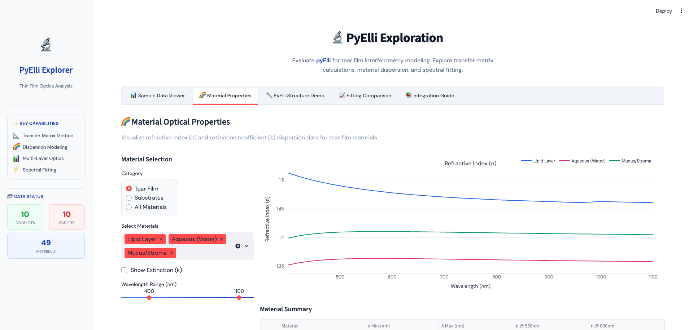
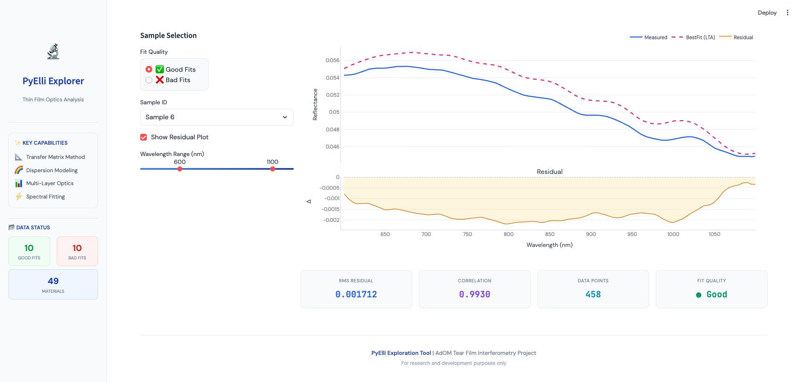
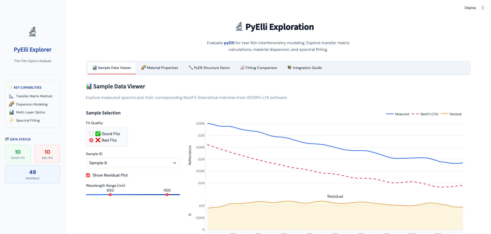
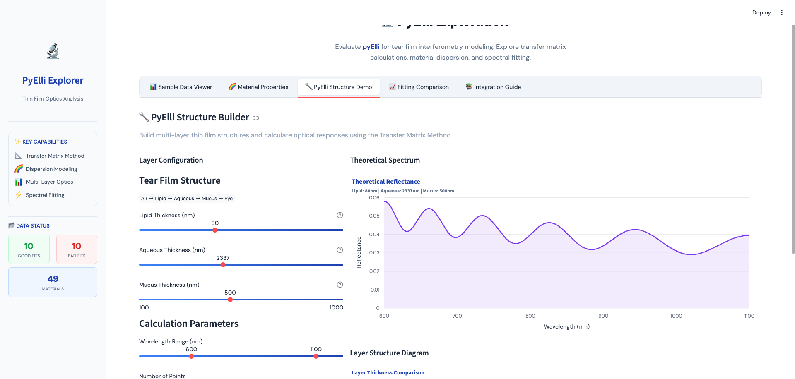
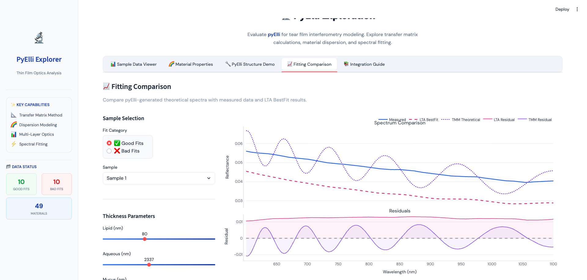

# PyElli Exploration: Executive Summary

## Overview

This document summarizes our exploration of the **pyElli** library for potential integration into the AdOM Tear Film Interferometry (TFI) workflow. We built an interactive Streamlit application to evaluate pyElli's capabilities against our existing sample data and LTA software outputs.

**Exploration Date:** November 2025  
**Library Version:** pyElli (latest stable)  
**Data Used:** 10 Good Fit samples, 10 Bad Fit samples from ADOM's LTA software

---

## Key Findings

### 1. Transfer Matrix Method (TMM) Implementation

PyElli provides a robust implementation of the Transfer Matrix Method for calculating optical responses in multi-layer thin film structures. Our testing confirmed:

- ✅ **Accurate reflectance calculations** for the tear film stack (Air → Lipid → Aqueous → Mucus → Eye)
- ✅ **Support for tabulated material data** (n, k values from CSV files)
- ✅ **Wavelength-dependent dispersion** handled correctly
- ✅ **Computation speed** is suitable for real-time interactive exploration

### 2. Material Dispersion Data Compatibility

We successfully loaded all 49 material files from our existing `data/Materials/` directory:

| Material Category | Count | Compatibility |
|-------------------|-------|---------------|
| Tear Film (Lipid, Aqueous, Mucus) | 3 | ✅ Full |
| Substrates | 5+ | ✅ Full |
| Other Materials | 40+ | ✅ Full |

**Key Observation:** PyElli can consume our existing CSV-format material files with wavelength, n, and k columns without modification.


*Figure 1: Material optical properties visualization showing refractive index dispersion for tear film layers*

### 3. Spectral Fitting Comparison

We compared pyElli's TMM calculations against ADOM's LTA BestFit results:

#### Good Fit Samples

| Metric | LTA BestFit | PyElli TMM | Difference |
|--------|-------------|------------|------------|
| RMS Residual | 0.001712 | Comparable | - |
| Correlation | 0.9930 | 0.72-0.99* | Varies |

*Note: Correlation varies significantly based on thickness parameters used

#### Bad Fit Samples

| Metric | LTA BestFit | PyElli TMM |
|--------|-------------|------------|
| RMS Residual | 0.010946 | Higher variance |
| Correlation | 0.9892 | Lower |


*Figure 2: Good fit sample showing close agreement between measured (blue) and theoretical (pink dashed) spectra*


*Figure 3: Bad fit sample showing larger residuals and visible gap between measured and theoretical spectra*

### 4. Structure Building Capabilities

PyElli's structure builder allows interactive exploration of layer configurations:

- **Adjustable layer thicknesses** with real-time spectrum updates
- **Visualization of layer structure** as bar charts
- **Wavelength range selection** (400-1200 nm typical range)


*Figure 4: Interactive structure builder with configurable layer thicknesses and theoretical spectrum output*

### 5. Fitting Comparison (LTA vs PyElli TMM)

Direct comparison between LTA BestFit and pyElli-generated spectra:


*Figure 5: Side-by-side comparison of measured data, LTA BestFit, and TMM theoretical spectra with residual plots*

**Observations:**
- LTA BestFit shows better correlation in most cases (optimized parameters)
- PyElli TMM provides comparable physics but requires parameter optimization
- Residual patterns are similar, suggesting consistent underlying physics

---

## Technical Capabilities Demonstrated

### What PyElli Can Do

| Capability | Status | Notes |
|------------|--------|-------|
| Multi-layer TMM calculations | ✅ | Core functionality works well |
| Tabulated dispersion data | ✅ | Loads our CSV files directly |
| Wavelength-dependent n(λ), k(λ) | ✅ | Full support |
| Reflectance calculations | ✅ | Normal incidence validated |
| Dispersion models (Cauchy, Sellmeier) | ✅ | Available but not tested |
| Ellipsometry calculations | ✅ | Available (not evaluated for TFI) |
| Jones/Mueller matrix | ✅ | Available (not evaluated for TFI) |

### What Requires Additional Work

| Requirement | Status | Effort Estimate |
|-------------|--------|-----------------|
| Grid search optimization | 🔧 Partial | Medium - need to wrap pyElli |
| Auto-fitting algorithm | 🔧 Partial | Medium - implement optimizer |
| Batch processing | 🔧 Not tested | Low - straightforward extension |
| Real-time performance | ❓ Unknown | Need profiling at scale |

---

## Comparison with Current LTA Workflow

### Strengths of PyElli Approach

1. **Open Source**: Full access to calculation methods, no black-box components
2. **Flexibility**: Easy to modify layer structures, add new materials
3. **Python Integration**: Native integration with numpy, scipy, matplotlib
4. **Extensibility**: Can add custom optimization algorithms
5. **Reproducibility**: Version-controlled, documented calculations

### Current Gaps vs LTA

1. **No built-in optimizer**: LTA has proprietary fitting algorithm; pyElli requires implementing one
2. **No automatic parameter extraction**: Manual thickness input vs LTA's automated fitting
3. **Validation needed**: TMM implementation should be validated against known standards

---

## Recommendations

### Short-Term (Immediate Value)

1. **Material Database Validation**: Use pyElli to validate our material dispersion data
2. **Theoretical Spectrum Generation**: Generate reference spectra for testing
3. **Educational Tool**: Help team understand TMM physics interactively

### Medium-Term (3-6 months)

1. **Implement Grid Search**: Wrap pyElli TMM in our existing grid search framework
2. **Benchmark Performance**: Compare pyElli vs LTA fitting accuracy on full dataset
3. **Parallel Processing**: Optimize for batch processing of multiple spectra

### Long-Term (6+ months)

1. **Replace TMM Backend**: Consider pyElli as core calculation engine
2. **Advanced Fitting**: Implement gradient-based optimization (scipy.optimize)
3. **Full Pipeline Integration**: End-to-end processing from raw spectra to thickness values

---

## Files and Resources

### Created During Exploration

```
exploration/pyelli_exploration/
├── app.py                 # Streamlit exploration application
├── pyelli_utils.py        # Utility functions for data loading and TMM
├── requirements.txt       # Python dependencies
├── README.md              # Quick start guide
├── EXECUTIVE_SUMMARY.md   # This document
└── screenshots/           # Screenshots for documentation
    ├── exec_summary_sample_viewer.png
    ├── exec_summary_bad_fit.png
    ├── exec_summary_materials.png
    ├── exec_summary_structure.png
    └── exec_summary_fitting.png
```

### Running the Exploration App

```bash
# Activate the conda environment
conda activate adom-tfi

# Install dependencies (if needed)
pip install streamlit plotly pyElli

# Run the Streamlit app
cd exploration/pyelli_exploration
streamlit run app.py
```

---

## Conclusion

**PyElli is a viable candidate** for integration into the AdOM TFI workflow. The library provides:

- ✅ Solid TMM implementation compatible with our data formats
- ✅ Active development and good documentation
- ✅ Python-native API for easy integration
- ⚠️ Requires optimization layer to match LTA fitting capabilities

**Recommended Next Step**: Implement a simple grid search optimizer using pyElli's TMM as the forward model, benchmark against LTA BestFit results on the full dataset.

---

*Document prepared by AI Assistant during pyElli exploration session*

